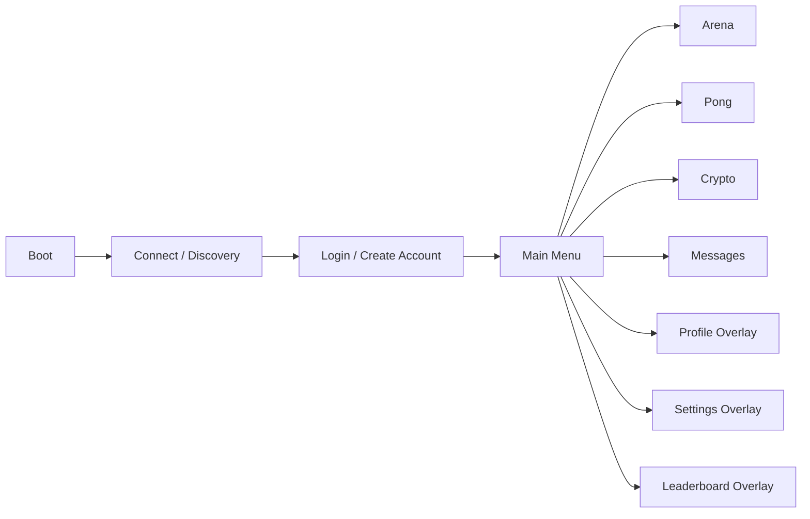

# Godot Scene Flow

## Global Rules

- Flow is fixed: `Boot -> Connect -> Login -> Main Menu -> Arena/Pong/Crypto/Messages`.
- There is no global sidebar.
- Entering Arena, Pong, Crypto, or Messages gives that mode full-screen ownership.
- Back/Exit always resolves to the previous mode boundary, not to hidden parallel screens.
- Profile, Settings, and Leaderboard are overlays, not permanent shell panels.

## High-Level Flow

## Scene Ownership Model

Only one primary scene is active at a time.

- Primary scenes:
  - `Boot`
  - `Connect`
  - `Login`
  - `MainMenu`
  - `ArenaModeShell`
  - `PongModeShell`
  - `CryptoModeShell`
  - `MessagesModeShell`
- Overlay scenes:
  - `ProfileOverlay`
  - `SettingsOverlay`
  - `LeaderboardOverlay`
  - `ConfirmExitOverlay`
  - mode-specific pause/loading overlays

Overlay scenes never replace the primary scene. They suspend input beneath them.

## Boot

Responsibilities:

- load local settings
- load saved host profiles
- resolve server locator URL
- decide whether a remembered session can attempt silent resume
- route to `Connect` or directly to `Login` if a reachable host is already selected

Allowed outputs:

- `Connect` if no reachable host is confirmed
- `Login` if a reachable host is confirmed but there is no valid session
- `Main Menu` only if both host probe and session restore succeed

Back rule:

- none; Boot is the root

## Server Connect / Discovery

Responsibilities:

- probe the saved host URL first
- if that fails, fetch and probe the locator target
- if that fails, allow manual URL entry
- if that fails, try local fallback `http://127.0.0.1:8080/` or configured local port

Required views inside the scene:

- discovery status
- saved host tile
- locator result tile
- manual URL entry
- local fallback tile
- offline/error state

Exit rules:

- successful probe -> `Login`
- explicit cancel/exit at this stage -> app exit confirm

Back rule:

- returns to Boot only if Boot has not yet committed to a host
- otherwise opens exit confirm

## Login / Create Account

Responsibilities:

- show login and register tabs in one scene
- submit credentials to the active Host
- store session token locally on success
- fetch `me`

Rules:

- successful login always lands on `Main Menu`
- account creation does not imply admin UI access in Godot even if the account is admin
- if the Host becomes unreachable here, return to `Connect`

Back rule:

- back returns to `Connect`

## Main Menu

The Main Menu is the only persistent player hub.

Required surface:

- four primary full-screen cards:
  - Arena
  - Pong
  - Crypto
  - Messages
- secondary controls:
  - Profile overlay
  - Settings overlay
  - Leaderboard overlay
  - disconnect / change host

Rules:

- no left nav or shell sidebar
- no inline admin widgets
- no embedded debug dashboard
- selecting a card replaces the Main Menu with the selected mode scene

Back rule:

- from Main Menu root, Back opens exit/disconnect confirm

## Arena Flow

Arena uses one mode shell with internal state ownership:

`ArenaModeShell = Loading -> Lobby -> Character Select -> Match -> Results`

### Arena Loading

Responsibilities:

- resolve room target from menu choice, invite code, or match-found payload
- show selected mode, stage, and room id
- send room join request

Exit:

- room join success -> `Arena Lobby` or directly `Character Select` depending on server state
- join failure -> back to Main Menu with error toast

### Arena Lobby

Responsibilities:

- show room id
- show roster
- show mode and stage
- allow copy room/invite code
- show ready state

Allowed actions:

- ready / unready
- leave room
- move forward automatically when the server enters character select

### Arena Character Select

Responsibilities:

- present character roster and selected fighter
- show ready lock and countdown
- no local simulation

Exit:

- server `loading` -> `Arena Match` loading overlay
- leave -> Main Menu

### Arena Match

Responsibilities:

- full-screen match HUD
- render authoritative arena snapshots
- send player inputs only
- show pause and reconnect overlays

Allowed overlays during live play:

- pause
- confirm leave
- reconnect/degraded state

Forbidden overlays during live play:

- profile
- leaderboard
- global settings panel over gameplay

### Arena Results

Responsibilities:

- show winners, scoreboard, CC credited, cortisol delta
- allow rematch
- allow Back to Main Menu

Back rule:

- results Back -> Main Menu
- match pause Leave -> Main Menu

## Pong Flow

Pong uses one mode shell with internal state ownership:

`PongModeShell = Loading -> Lobby -> Match -> Results`

### Pong Loading

- resolve room target
- show room code and Host
- send join request

### Pong Lobby

- show left/right paddle slots
- show spectators
- show room state
- wait for match start

### Pong Match

- full-screen playfield and HUD
- render server-authoritative ball and paddle state
- send up/down input only
- support pause/leave/reconnect overlays

### Pong Results

- show winner, score, cortisol delta
- allow rematch
- allow Back to Main Menu

Back rule:

- results Back -> Main Menu
- live match Back -> pause overlay, never immediate exit

## Crypto Flow

Crypto is one full-screen mode with internal local sub-navigation:

`CryptoModeShell = Home / Wallet / Market / Explorer / Activity`

Rules:

- no global sidebar
- mode-level tab strip or card rail only inside the full-screen Crypto scene
- Back from any Crypto subview returns to Main Menu
- Profile/Settings/Leaderboard may open as overlays above Crypto

Subview requirements:

- `Home`
  - portfolio summary
  - cortisol summary
  - recent market stats
- `Wallet`
  - single primary player wallet in Godot V1
  - balances
  - recent transfers and exchange events
- `Market`
  - token list
  - token detail
  - read-only in the first Godot integration phase
- `Explorer`
  - blocks
  - transactions
  - wallet pages
  - token pages
- `Activity`
  - combined recent wallet, trade, launch, and explorer-visible events

## Messages Flow

Messages is one full-screen mode with internal local sub-navigation:

`MessagesModeShell = Thread List / Chat View / Group Creation`

### Thread List

- DM thread summaries
- unread markers
- user search

### Chat View

- message history
- composer
- attachment send/download/delete controls if permitted by server

### Group Creation

Required scene ownership:

- separate in-mode view, not an overlay
- if the server does not yet support groups, this view must show a blocked/unavailable state
- the client must not fake local-only group creation

Back rules:

- Chat View Back -> Thread List
- Group Creation Back -> Thread List
- Thread List Back -> Main Menu

## Profile, Settings, Leaderboard Overlays

These are overlays, not primary destinations.

### Profile Overlay

- current account identity
- cortisol tier
- wins/losses/KOs
- no admin controls

### Settings Overlay

- audio
- display/fullscreen
- reconnect diagnostics
- host change shortcut

### Leaderboard Overlay

- top players
- current player rank if logged in
- may be opened from Main Menu, Crypto, Messages, Arena Results, or Pong Results

Overlay restriction:

- live Arena/Pong gameplay may only use pause/reconnect overlays
- Profile, Settings, and Leaderboard do not open over active live match state

## Back / Exit Rules

| Current Scene | Back Result |
| --- | --- |
| Boot | no action |
| Connect | exit confirm or Boot before host selection |
| Login / Create Account | Connect |
| Main Menu | exit/disconnect confirm |
| Arena Loading / Lobby / Character Select | Main Menu |
| Arena Match | pause overlay |
| Arena Results | Main Menu |
| Pong Loading / Lobby | Main Menu |
| Pong Match | pause overlay |
| Pong Results | Main Menu |
| Crypto any subview | Main Menu |
| Messages Thread List | Main Menu |
| Messages Chat | Thread List |
| Messages Group Creation | Thread List |

## No Sidebar Rule

The Godot client must not recreate the web SPA shell.

- no persistent left nav
- no inspector rail
- no debug sidebar
- no mode switching while another mode remains partially visible

Every mode owns the full viewport until Back or Exit.

## Full-Screen Mode Ownership Rule

Mode ownership is strict:

- `Main Menu` owns the full viewport until a mode is entered.
- `Arena` owns the full viewport until the player leaves or reaches results.
- `Pong` owns the full viewport until the player leaves or reaches results.
- `Crypto` owns the full viewport until Back to Main Menu.
- `Messages` owns the full viewport until Back to Main Menu.

The next mode is not mounted underneath the current one. Scene swaps are explicit.
